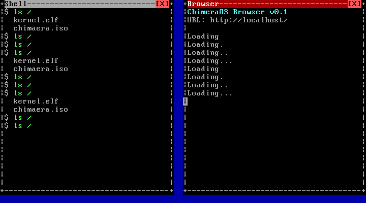

# ChimeraOS Window Compositor Design

**Author:** Manus AI  
**Date:** 2026-05-16  
**Status:** Prototype complete

---

## 1. Audit Findings: Current State

The `src/gui/` directory did not previously exist. The entire display layer consisted of a single 80×25 VGA text-mode driver in `src/drivers/vga.c`, operating under a strict "whole screen belongs to one app" model.

| Component | Current State |
| :--- | :--- |
| `src/gui/` | **Did not exist** |
| `src/drivers/vga.c` | 80×25 text buffer at `0xB8000`; global cursor; `vga_putchar`, `vga_puts`, `vga_clear` |
| Input layer | Global ring buffer `g_input_ring` (64 events); keyboard + mouse events; no window routing |
| Memory | 2 MB bump allocator (`kmalloc`); no `kfree` |
| Scheduler | Round-robin, up to 4 tasks, 16 KiB stacks |

The VGA driver writes directly to `0xB8000` with a single global cursor position. There is no concept of a window, a clip region, or a z-order. Any task that calls `vga_puts` corrupts the output of every other task.

---

## 2. Compositor Architecture

### 2.1. Design Principles

The compositor is designed around three constraints imposed by the existing kernel:

1. **Text-mode first.** The prototype operates in 80×25 VGA text mode. This avoids requiring a VESA linear framebuffer driver and allows the compositor to run on the existing hardware support. The VESA upgrade path is described in Section 5.
2. **No dynamic allocation.** Because `kfree` is a no-op, all window structures are allocated from a fixed-size pool (`COMP_MAX_WINDOWS = 8`). Window content buffers are embedded directly in the `window_t` struct.
3. **Back-buffer compositing.** The compositor maintains a `uint16_t backbuf[80×25]` array. All drawing operations target the back-buffer; a single `comp_render()` call flushes it to `0xB8000`. This prevents tearing and allows multiple tasks to write to their own windows without interfering with each other.

### 2.2. Data Structures

The central type is `window_t`, defined in `src/gui/compositor.h`:

```c
typedef struct window {
    int x, y;                      /* top-left corner (character cells)     */
    int w, h;                      /* total width/height including borders  */
    char title[COMP_TITLE_LEN + 1];
    bool active;
    bool focused;
    cell_t buf[WIN_BUF_SIZE];      /* backing character buffer              */
    int cursor_col, cursor_row;
} window_t;
```

The `compositor_t` struct owns an array of `COMP_MAX_WINDOWS` window slots, a `z_order[]` array that maps draw order to slot indices, the mouse cursor position, and the back-buffer:

```c
typedef struct {
    window_t windows[COMP_MAX_WINDOWS];
    int z_order[COMP_MAX_WINDOWS]; /* z_order[0] = bottom, [n-1] = top     */
    int nwindows;
    int mouse_x, mouse_y;
    uint16_t backbuf[COMP_COLS * COMP_ROWS];
} compositor_t;
```

### 2.3. Window Layout

Each window frame occupies `w × h` character cells on screen:

```
col:  x  x+1  ...  x+w-4  x+w-3  x+w-2  x+w-1
row y:  +  T  T  T  T  T  [  X  ]  +    ← title bar
row y+1:|  content area            |
...
row y+h-1: +  -  -  -  -  -  -  -  +    ← bottom border
```

The title bar uses a grey attribute (`0x70`) for unfocused windows and a red attribute (`0x4F`) for the focused window. The `[X]` close button uses a bright-red attribute (`0xC0`).

### 2.4. Rendering Pipeline

`comp_render()` composites the scene in four steps:

1. **Desktop fill** — the entire back-buffer is filled with `' '` on a blue background (`0x17`).
2. **Window draw (back-to-front)** — for each entry in `z_order[0..nwindows-1]`, `render_window()` draws the border, title bar, and content area into the back-buffer.
3. **Cursor** — the cell under `(mouse_x, mouse_y)` has its foreground and background nibbles swapped (colour inversion).
4. **VGA flush** — the back-buffer is copied to `volatile uint16_t *0xB8000` in a single loop.

### 2.5. Input Routing

The compositor consumes events from `g_input_ring`:

| Event | Action |
| :--- | :--- |
| Mouse move | Update `(mouse_x, mouse_y)`, call `comp_render()` |
| Left click | `comp_hit_test()` from top z-order; bring hit window to front; detect `[X]` close button |
| Key press | Route ASCII to the focused window via `comp_win_putchar()` |

`comp_hit_test()` scans `z_order` from top to bottom, returning the first window whose frame rectangle contains the click coordinates. This correctly handles overlapping windows.

### 2.6. Z-Order Management

`comp_bring_to_front(idx)` removes the window from its current position in `z_order[]`, shifts all higher entries down by one, and inserts it at `z_order[nwindows-1]`. Focus (the `focused` flag) is transferred from the old top window to the new top window. This is an O(n) operation, which is acceptable for `n ≤ 8`.

---

## 3. Implementation

The prototype is implemented in two new files:

| File | Lines | Purpose |
| :--- | ---: | :--- |
| `src/gui/compositor.h` | 130 | Public API, type definitions, constants |
| `src/gui/compositor.c` | 330 | Full implementation |
| `src/kernel/kernel_gui.c` | 185 | Two-window demo kernel |

The demo kernel spawns two scheduler tasks — `task_shell` and `task_browser` — that write to their respective windows every 500 ms. Both tasks call `comp_render()` after each write to flush the back-buffer to VGA.

---

## 4. Demo Results

The demo was verified under QEMU (`-m 128`, VGA std, no USB). The screenshot below was captured at approximately 5.5 seconds into the 6-second demo run:



The serial log confirms correct operation:

```
[GUI_DEMO] starting
[GUI_DEMO] window created: Shell (idx=0)
[GUI_DEMO] window created: Browser (idx=1)
[SCHED] Scheduler initialised (task 0 = main)
[SCHED] Spawned task 1 (shell)
[SCHED] Spawned task 2 (browser)
[GUI_DEMO] compositor running
[SCHED] Starting scheduler (enabling interrupts)
[SCHED] Task 1 (shell) exited
[SCHED] Task 2 (browser) exited
[SCHED] All tasks complete
[GUI_DEMO] elapsed_ms=6310
[GUI_DEMO] PASS
```

Both windows are visible simultaneously. The Shell window (grey title bar, left) shows `$ ls /` commands with bright-green filenames. The Browser window (red focused title bar, right) shows the browser header and animated `Loading...` progress.

---

## 5. Future Work

### 5.1. VESA Linear Framebuffer

To move from text mode to pixel-based graphics:

1. Use GRUB's `set gfxmode` and `set gfxpayload` to request a VESA mode (e.g., 1024×768×32bpp) before loading the kernel.
2. Read the framebuffer base address, pitch, and bits-per-pixel from the Multiboot information structure.
3. Replace `uint16_t backbuf[80×25]` with a `uint32_t *backbuf` of `width × height` pixels.
4. Replace the VGA flush loop with a `memcpy` to the framebuffer base address.
5. Implement a bitmap font renderer to draw text in the pixel buffer.

### 5.2. Dynamic Window Management

The current bump allocator makes `kfree` a no-op. To support dynamic window creation and destruction, implement a free-list allocator in `src/mm/mm.c`. The window content buffers (`WIN_BUF_SIZE = 78 × 21 = 1638` cells × 2 bytes = ~3.2 KB per window) are small enough to be managed with a slab allocator.

### 5.3. Window Dragging

`comp_on_mouse_click()` already detects title-bar clicks. To implement dragging:

1. On title-bar click, record `drag_start_x = mouse_x - win->x` and `drag_start_y = mouse_y - win->y`.
2. On subsequent mouse-move events while the button is held, update `win->x = mouse_x - drag_start_x` and `win->y = mouse_y - drag_start_y`, clamping to screen bounds.
3. Call `comp_render()` after each move.

### 5.4. Alpha Blending

In pixel mode, replace the simple back-to-front copy with a per-pixel alpha blend:

```
out = (src_alpha * src_color + (255 - src_alpha) * dst_color) / 255
```

This enables translucent window shadows and smooth window animations.

### 5.5. xHCI / USB Mouse Integration

The existing `hid_mouse_poll()` posts `INPUT_TYPE_MOUSE` events with relative `(dx, dy)` to `g_input_ring`. The compositor loop should consume these events and call `comp_on_mouse_move(c, cursor_x + dx, cursor_y + dy)`. This wires the physical USB mouse directly to the compositor cursor.
