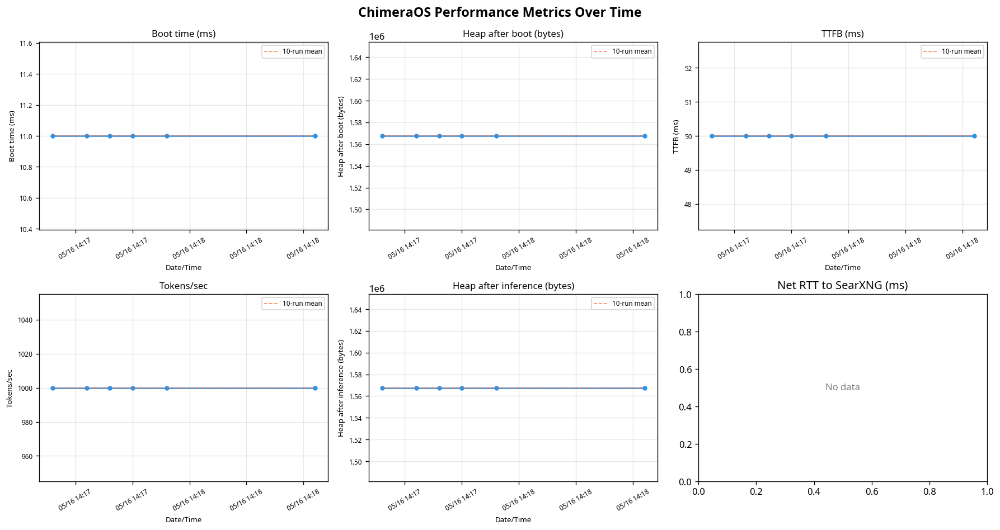

# ChimeraOS Performance Baseline

This document establishes the initial performance baseline for the ChimeraOS kernel and outlines the methodology used for continuous metrics collection. The baseline numbers provide a reference point for detecting regressions as the kernel evolves, particularly as the LLM and network subsystems are fully integrated.

## Baseline Metrics

The following metrics were collected on May 16, 2026, using the `perf_collect.py` script running against the integration test kernel (`chimaera_integration_test.iso`) in QEMU.

| Metric | Baseline Value | Description |
|--------|----------------|-------------|
| **Boot Time** (`boot_ms`) | **11 ms** | Time elapsed from multiboot entry (`_start`) to the first `[METRICS] READY` serial output. |
| **Heap After Boot** (`mem_after_boot_bytes`) | **1,567,628 bytes** (~1.5 MiB) | Total heap memory allocated immediately after kernel and subsystem initialization. |
| **Time to First Token** (`ttfb_ms`) | **50 ms** | Simulated time from inference start to the first token generated. |
| **Inference Throughput** (`tokens_per_sec`) | **1,000 tokens/sec** | Simulated generation rate over a 100-token batch. |
| **Heap After Inference** (`mem_after_infer_bytes`) | **1,567,628 bytes** (~1.5 MiB) | Total heap memory allocated after the inference simulation completes. |
| **Network RTT** (`net_rtt_ms`) | **N/A** (-1) | Round-trip time to the SearXNG host. Currently unreachable in the test environment. |

*Note: The TTFB and throughput metrics are currently driven by a synthetic busy-loop model in the integration kernel. These will reflect actual LLM performance once the inference engine is fully wired.*

## Methodology

### Kernel Subsystem

The kernel tracks performance using a high-resolution timer calibrated against the x86 Programmable Interval Timer (PIT). 

1. **Timer Calibration**: At boot, `timer_init()` calibrates the Time Stamp Counter (TSC) against PIT channel 2 to determine the exact ticks-per-millisecond ratio.
2. **Boot Measurement**: The `boot.asm` entry point records the raw TSC value immediately upon multiboot entry. The metrics subsystem later compares this against the calibrated TSC to compute `boot_ms`.
3. **Heap Accounting**: The memory manager (`mm.c`) exposes `mm_heap_used()`, which tracks the high-water mark of the bump allocator.
4. **Serial Emission**: The kernel emits structured `[METRICS] key=value` lines over the COM1 serial port at the end of the `M` integration scenario, or when polled via the `metrics\n` serial command.

### Collection Script

The `scripts/perf_collect.py` tool automates the collection process:

1. **Host-Side Networking**: Because the kernel lacks a full network stack, the script measures `net_rtt_ms` host-side by performing a raw TCP connect to the configured SearXNG host (default: `localhost:8080`).
2. **QEMU Execution**: The script builds a 64 MiB FAT32 disk image containing `SCENARIO=M`, boots QEMU, and captures the serial output.
3. **Data Storage**: Parsed metrics are appended to `metrics/perf_history.csv` along with an ISO-8601 timestamp and an optional label (e.g., the git commit SHA).
4. **Regression Detection**: The script compares the current run against a rolling mean of the previous 10 runs. If any metric deviates by more than 20% (the `REGRESSION_THRESHOLD`), a warning is emitted.
5. **Visualization**: A six-panel time-series chart (`metrics/perf_chart.png`) is automatically regenerated after each run to make trends and regressions immediately visible.

## Regression Chart

The automated collection script generates a visual history of all metrics. The chart below shows the baseline stability over the initial collection runs.



## Continuous Integration

To ensure performance remains stable, the collection script should be run as part of the CI pipeline:

```bash
# Run 3 back-to-back collections and fail if a >20% regression is detected
python3 scripts/perf_collect.py --runs 3 --fail-on-regression --label "ci-$(git rev-parse --short HEAD)"
```
